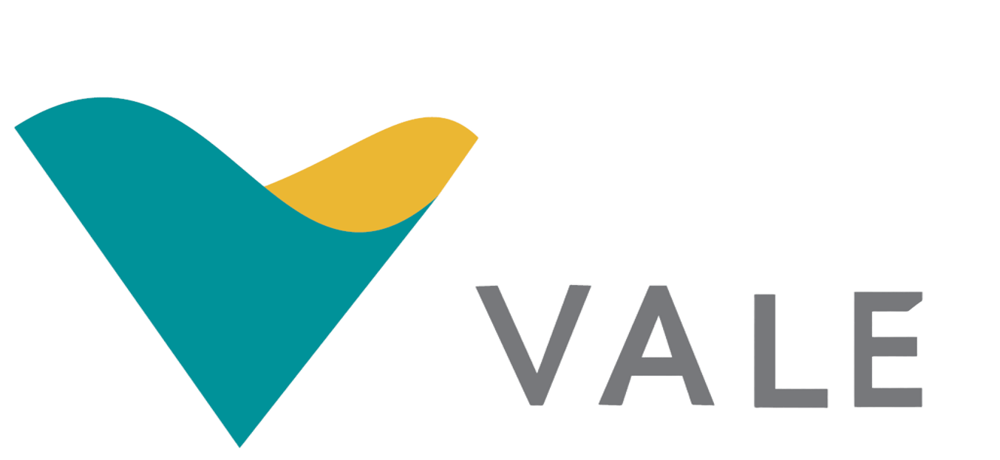
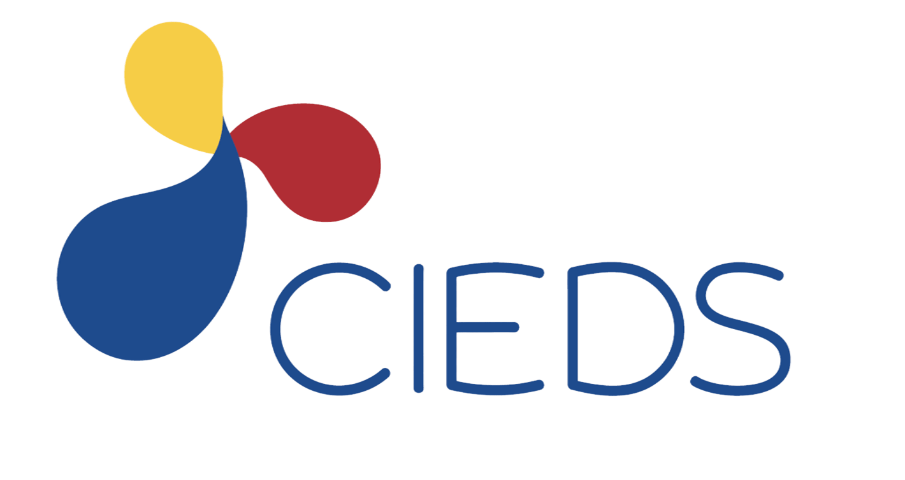
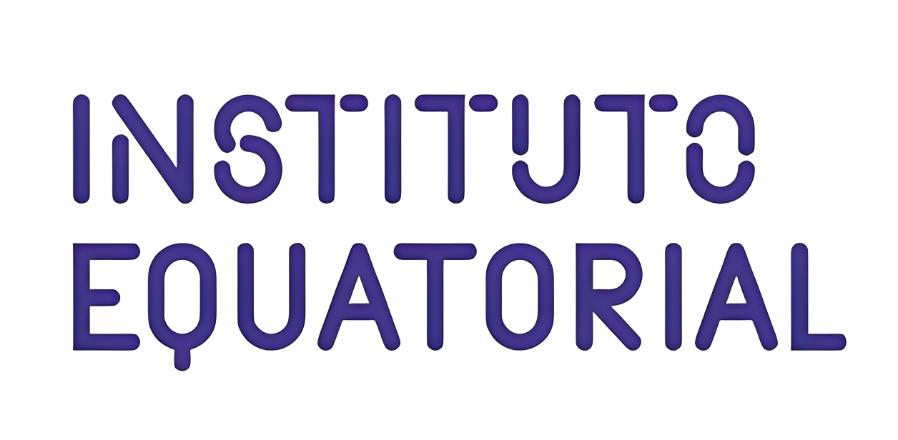

# 🌱 Rede de Prosperidade Familiar
---
> Uma tecnologia social que transforma dados em prosperidade.
---
## 📌 Sobre o projeto

A **Rede de Prosperidade Familiar** integra o programa **Juntos Contra a Pobreza**, iniciativa da **Vale**, e é implementada pelo **CIEDS** desde 2023.

O projeto atua junto a organizações de base comunitária no território do **Itaqui-Bacanga**, fortalecendo sua atuação em rede e ampliando o acesso das famílias a direitos e oportunidades relacionados a renda, educação, saúde, infraestrutura e segurança alimentar.

---

## 📊 Dados e tecnologia

Esta conta reúne repositórios relacionados ao uso de dados e tecnologia no projeto, contribuindo para o acompanhamento dos indicadores, organização das informações e melhoria de processos.

Entre as principais frentes estão:

- 🔎 Análise e tratamento de dados
- 📈 Geração de indicadores e relatórios
- 🤖 Desenvolvimento de automações
- 📁 Documentação e preservação das soluções desenvolvidas

### 🛠️ Principais tecnologias

`Python` · `Pandas` · `Excel` · `GitHub` · `Power BI` · `Looker Studio`

---

## 📂 Repositórios

Os repositórios do projeto ficam hospedados na conta do **CIEDS** no GitHub. Este perfil atua como **colaborador**, contribuindo com o desenvolvimento, a documentação e a manutenção das soluções construídas ao longo do projeto.

Essa organização busca facilitar a manutenção das ferramentas e garantir que as soluções desenvolvidas possam permanecer como **legado técnico do projeto**.

---

## 🤝 Parceiros

&nbsp;&nbsp;&nbsp;
&nbsp;&nbsp;&nbsp;
&nbsp;&nbsp;&nbsp;
&nbsp;&nbsp;&nbsp;

**Articulação:** Vale  
**Implementação:** CIEDS  
**Coinvestidores:** Wabtec, Instituto Equatorial, Usimig

---

  

